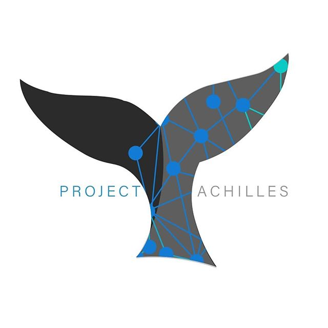

## [WIP]Project Achilles - A Static Source Code Vulnerability Identifier


# Todo
1. Get F1-Score, Accuracy & Precision of Model

### Just Add Water!
1. Download the [NIST Juliet Stand-alone Suite for Java](https://samate.nist.gov/SRD/testsuites/juliet/Juliet_Test_Suite_v1.3_for_Java.zip).


### Using Achilles from the Terminal
* `achilles <file>` - Achilles will attempt to automatically decide the language to use based on the file extension. 

* `achilles <language> <file>` - Intended for use with source code that may have an obscure file extension.

* `achilles <language> <folder>` - This command will recursively traverse an entire folder and evaluate any files
 with extensions pertaining to the language specified. If more than 100 compatible files are found, Achilles will 
 prompt the user before continuing.

* `achilles train <language>` - Retrains the model on <language>_balanced_data.csv; this command does not automatically
 re-balance the training data.

* `achilles balance <language>` - Rebalance raw <language>_good.txt and <language>_bad.txt, generating the
 <language>_balanced_data.csv used to train the model.


## Building Achilles Support for Other Languages
Project Achilles was designed with crowd-sourcing in mind.
In theory, adding additional language support should be relatively simple.
1. Add an entry to the dictionary `languages` such that the key is the name of
the language, and the value is a list of the possible file extensions for files
of that type. Note that the key of this dictionary will be the language keyword 
used in the command line when calling Achilles. Multiple different language 
variants can be added by repeating the same value list for a different key,
effectively representing the same language in more than one different ways.
This may be useful if a language may be tedious to type out in terminal, for instance,
C++, Visual Basic, Objective-C, c#, and other languages with punctuations that slow
down typing... 
1. Modify the if-statement in the main() method of achilles.py by adding:
    ```
    elif lang == <name of language key>:
        <Name of language key>lect.execute_routine(files)
    ```
1. Create a &lt;name of language key&gt;lect.py file with the necessary functions
to transform the code in that language as required by the neural network.
Follow the conventions in achilles.py as a guide.

https://www.kaggle.com/kredy10/simple-lstm-for-text-classification/notebook